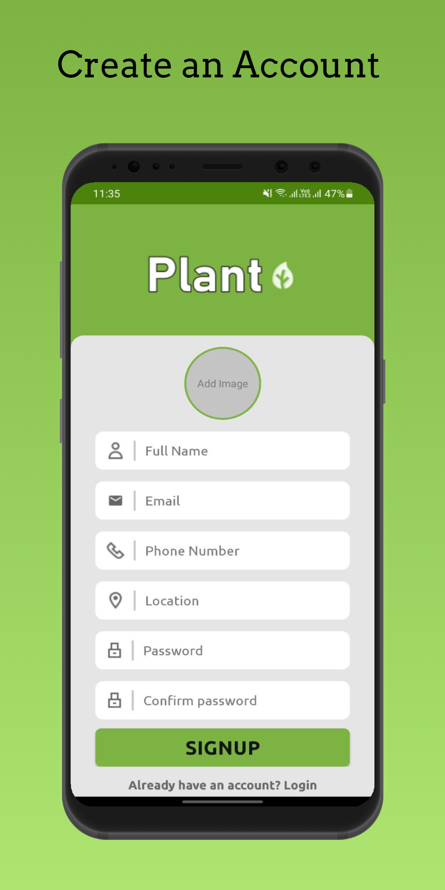
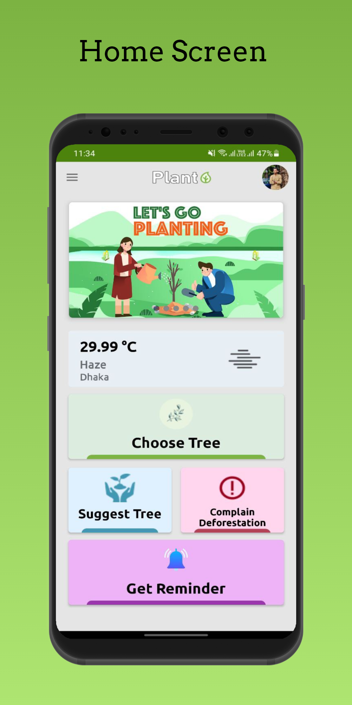

📊 Bill Tracker
Bill Tracker is a simple yet powerful mobile application built with Kotlin + Jetpack Compose to help users keep track of their recurring bills, manage due dates, and calculate totals with live currency conversion.

⚙️ Setup & Build Instructions
Prerequisites

- Android Studio Ladybug+
- JDK 17+
- Gradle 8.13+
- Kotlin 2.0.21+
- Internet connection for currency conversion API

Steps

1. Clone the repository:
```
git clone https://github.com/yourusername/bill-tracker.git
cd bill-tracker
```

2. Open the project in Android Studio.
3. Sync Gradle files and let dependencies download.
4. Add your Exchange API key inside the OkHttp Interceptor:
5. kotlin.addQueryParameter("access_key", "YOUR_API_KEY")

6. Build & Run


🏗️ Architecture & Libraries Used
Architecture

- Clean Architecture (Data, Domain, Presentation)
- MVVM + MVI state management
- Reactive UI with Jetpack Compose
- Repository pattern with API 

Libraries:
UI & Navigation->

- Jetpack Compose
- Navigation Compose

Dependency Injection->

- Koin

Networking->

- Retrofit
- OkHttp + Logging Interceptor

Asynchronous ->

- Kotlin Coroutines & Flow

Other->

- Napier (logging)
- Gson (JSON parsing)


✅ Completed Features

- Add / Edit / Delete bills
- Input validation:
- Bill list with filters:
- Currency conversion for totals
- Dark & light theme support


⏳ Pending Features
- Multi-currency support


⚖️ Trade-offs & Design Decisions

- Clean Architecture chosen for maintainability & testability (extra boilerplate but scalable).
- Koin instead of Hilt for easier setup and multiplatform readiness.
- Compose-only UI – no XML, reduces code duplication but adds learning curve for animations.
- Napier logger – better multiplatform logging than Timber.
- Currency conversion depends on API response – fallback cache ensures offline support.

<p align="center">
  
  
</p>


🧑‍💻 Author:
Towhidul Islam,
Mobile App Developer,
💻 Kotlin | Jetpack Compose | KMP
